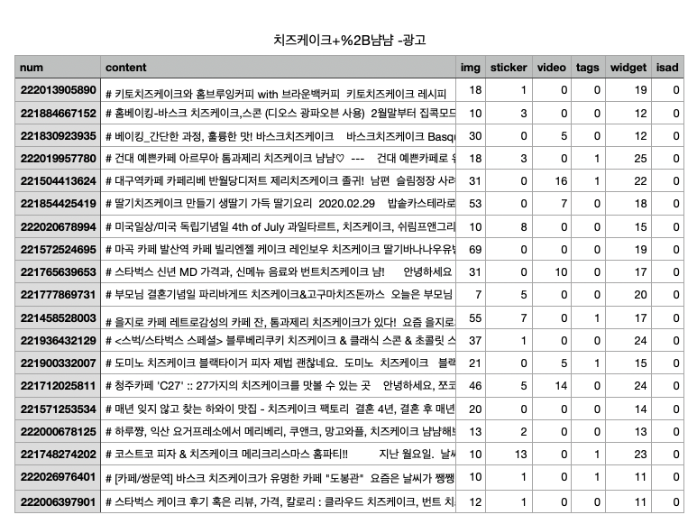

# 코알라 해커톤 : 리뷰를 낚는 자들 

[](https://travis-ci.org/joemccann/dillinger)

  - 20.07.07 ~ 
  - flagly 대회 제출용 ( 프로젝트 설명 )
https://www.flagly.org/course/courses/130/
네이버 블로그 링크 수집은 URL의 파라미터값으로 검색 키워드를 전달하여 검색한다. 또한 chromedriver을 이용하여  동적으로 페이지를 넘김으로써 대량의 블로그 주소를 한번에 불러와 한 csv파일에 데이터를 수집할 수 있게 한다. 

네이버 블로그 본문 수집의 경우, 네이버 블로그 본문이 iframe요소로 이루어져있어 inner_html이 따로 존재한다는 점을 유의해야한다. 따라서 iframe요소의 소스 파일에서 src를 찾아서 inner_html으로 redirect하는 과정이 필요하다. 또한 네이버 블로그 본문의 각 문장 및 콘텐츠마다 서로 다른 <div>로 분리되어 있어 class값으로 텍스트와 컨텐츠를 분류하고 각 요소 별로 데이터를 병합하여 리턴하는 함수를 따로 정의한다.

pasing_blog.py 와 download_naver_blog.py는 오픈소스(https://github.com/chandong83/download-naver-blog)를 참고 및 변형하여 사용했다.


crawl.py

네이버 검색창에 설정한 키워드를 검색한 뒤 블로그 주소를 불러오는 파이썬 파일이다. 세부 기능은 다음과 같다. 

Chromedriver 사용하여 검색 페이지 불러오기 및 페이지 넘기기  

키워드를 URL파라미터로 전달하고, 상세 키워드를 사전 설정하여 정확도 높이기 ( 정확하게 일치해야 하는 단어, 반드시 포함해야 할 단어, 제외되어야 할 단어 )

csv모듈을 사용하여 크롤링한 데이터를 저장할 csv파일 생성 및 헤더 값 설정

반복문에서 추출할 페이지 최대값 설정

검색 결과 페이지에서 블로그의 각 링크를 추출한 뒤 download_naver_blog.py에 정의되어있는 Crawler 함수의 인자로 넘겨 본문 내용 크롤링


pasing_blog.py

BeautifulSoup 모듈을 이용해 본문 html을 크롤링한 후 필요한 값을 리턴하는 파이썬 파일이다. 세부 기능은 다음과 같다. 

Parser 클래스가 정의 되어 있다. 세부 메소드로는 다음과 같은 기능이 정의되어있다. 

redirect_url : 본문이 iframe요소로 이루어져있는 경우 src값을 추출하여 리다이렉트 링크를 다시 생성하여 접속

text : 글 제목 , 본문 텍스트, 태그 텍스트 크롤링하여 텍스트 리턴

hashtags : 태그 존재 여부 값 리턴

imgCnt : 본문 내 삽입 된 이미지 개수 리턴

stickerCnt : 본문 내 삽입 된 네이버 스티커 개수 리턴

videoCnt : 본문 내 삽입 된 비디오 개수 리턴


download_naver_blog.py

Parser함수를 통해 크롤링한 데이터 값을 각 열에 맞추어 csv 파일에 저장하는 파일이다. 세부 내용은 다음과 같다. 

Crawler 클래스가 정의 되어 있다. 세부 메소드로는 다음과 같은 기능이 정의되어있다. 

isad값을 설정하여 종속변수값 저장

pasing_blog.py에서 Parser를 불러와 실행

Parser함수를 실행해 리턴한 텍스트를 txt 파일에 저장

위 과정에서 저장된 txt파일을 csv의 content 열에 저장

이 외에 Parser함수를 실행해 리턴한 값(img, sticker, video, tags) csv파일에 저장


- 소개 동영상
https://youtu.be/EdqCfbtKdcw

# New Features! (20.07.22 수정)

- 네이버 검색어 상세 설정 가능 
  - 특정 키워드 반드시 포함, 제외, 정확히 일치 
- 수집 가능한 데이터 
  - 게시글 주소(num), 텍스트(content), 사진 수(img)
  - 비디오 수(video), 블로그 내 위젯 개수(widget) 
  - 텍스트 내 태그 존재 여부 (tags) 
  - 광고글 판단 여부 (isad)
  
- 검색어 별 수집한 데이터 csv 파일로 저장 

- csv 파일 예시




You can also:
  - 사진 파일 크롤링 및 저장
  - 페이지 내 full_code 저장 가능


### Tech

* [Python] - 


### Installation

실행 방법 

```sh
$ cd naverblog
$ python3 crawl.py 
```


License
----

네이버 블로그 txt 추출 코드 출처
:: https://github.com/chandong83/download-naver-blog


** 냠 !**

[//]: # (These are reference links used in the body of this note and get stripped out when the markdown processor does its job. There is no need to format nicely because it shouldn't be seen. Thanks SO - http://stackoverflow.com/questions/4823468/store-comments-in-markdown-syntax)


   [dill]: <https://github.com/joemccann/dillinger>
   [git-repo-url]: <https://github.com/joemccann/dillinger.git>
   [john gruber]: <http://daringfireball.net>
   [df1]: <http://daringfireball.net/projects/markdown/>
   [markdown-it]: <https://github.com/markdown-it/markdown-it>
   [Ace Editor]: <http://ace.ajax.org>
   [node.js]: <http://nodejs.org>
   [Twitter Bootstrap]: <http://twitter.github.com/bootstrap/>
   [jQuery]: <http://jquery.com>
   [@tjholowaychuk]: <http://twitter.com/tjholowaychuk>
   [express]: <http://expressjs.com>
   [AngularJS]: <http://angularjs.org>
   [Gulp]: <http://gulpjs.com>

   [PlDb]: <https://github.com/joemccann/dillinger/tree/master/plugins/dropbox/README.md>
   [PlGh]: <https://github.com/joemccann/dillinger/tree/master/plugins/github/README.md>
   [PlGd]: <https://github.com/joemccann/dillinger/tree/master/plugins/googledrive/README.md>
   [PlOd]: <https://github.com/joemccann/dillinger/tree/master/plugins/onedrive/README.md>
   [PlMe]: <https://github.com/joemccann/dillinger/tree/master/plugins/medium/README.md>
   [PlGa]: <https://github.com/RahulHP/dillinger/blob/master/plugins/googleanalytics/README.md>
